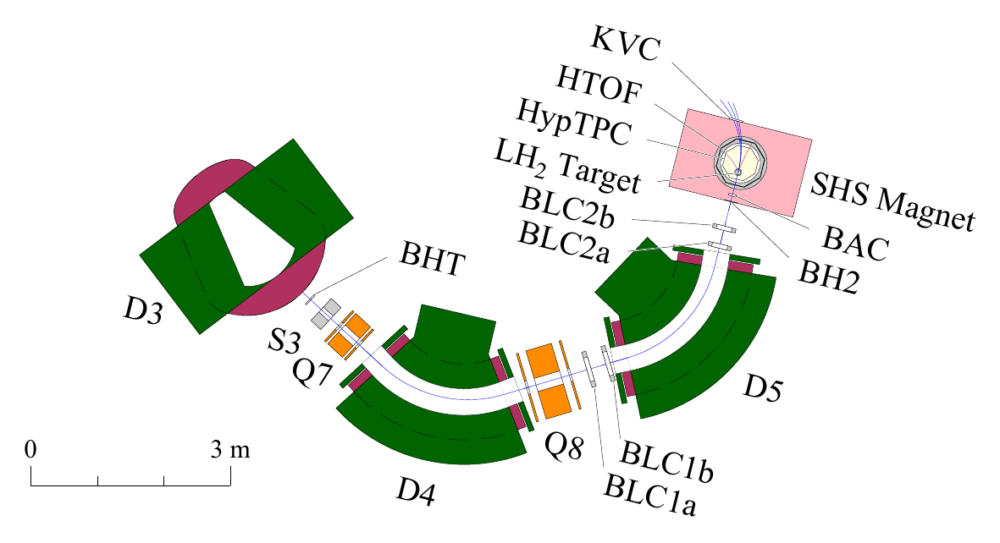

setup-drawing
=============

Generates a publication-quality overview figure of the J-PARC E72
experimental setup in the K1.8BR beam line, output as PDF via PostScript.



(the `bac_nim` variant; the default `./run.py` draws the full `e72`
figure including the forward arm)

The beam flight length from BHT to BH2, along the central orbit through
D4 and D5, is about 8 m.

Setup
-----

Create a virtual environment and install the dependencies (PyYAML):

```sh
$ python3 -m venv .venv
$ .venv/bin/pip install pyyaml
```

Usage
-----

```sh
$ source .venv/bin/activate
$ ./run.py > tmp.ps                 # default: conf/e72.yml
$ ps2pdf tmp.ps tmp.pdf
$ pdfcrop --margins 10 tmp.pdf tmp.pdf
```

`pdfcrop` (TeX Live) trims the output to the drawn content. As an
alternative, set `bbox: [x0, y0, x1, y1]` (page mm) in the config and
use `ps2pdf -dEPSCrop`.

Drawing settings (paper size, scale, fonts, colors, tracks, which
labels to show) live in `conf/*.yml`. The default is `conf/e72.yml`
(full setup); pass another preset as the first argument, e.g.
`./run.py conf/bac_nim.yml > tmp.ps` for the BAC NIM figure. Each
preset is named by its `variant` key, which also goes into the
PostScript `%%Description`.

Modules
-------

- `run.py` -- entry point; draws all components.
- `module/config.py` -- loads a `conf/*.yml` preset into module
  attributes.
- `module/pshelper.py` -- PostScript drawing primitives (paths, arcs,
  text tags).
- `module/geomhelper.py` -- FF-coordinate helpers (`ff_angle`,
  `ff_to_xy`).
- `module/shs.py` -- SHS magnet, HypTPC, target, tracks from the target.
- `module/counter.py` -- counters (BAC, BH2, BHT, KVC, FTOF, ...).
- `module/driftchamber.py` -- BLC1a/b and BLC2a/b drift chambers.
- `module/beamline.py` -- K1.8BR beam line elements (D3/D4/D5 bending
  magnets, Q7/Q8 quadrupoles, S3 slit).

The element geometries are taken from the CAD drawings (kept locally;
excluded from this repository) and reference documents; details are
documented as comments in each module.
